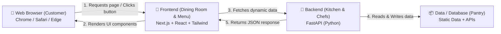
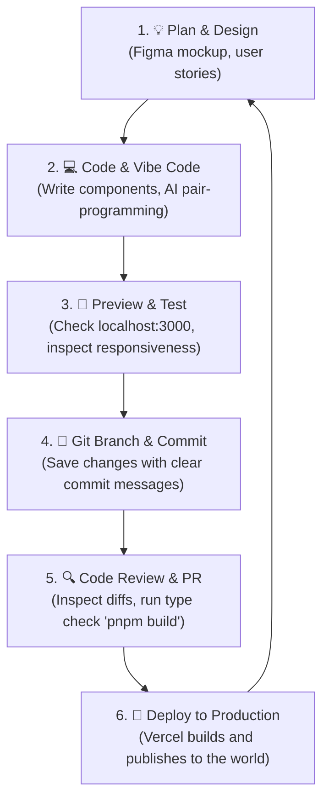
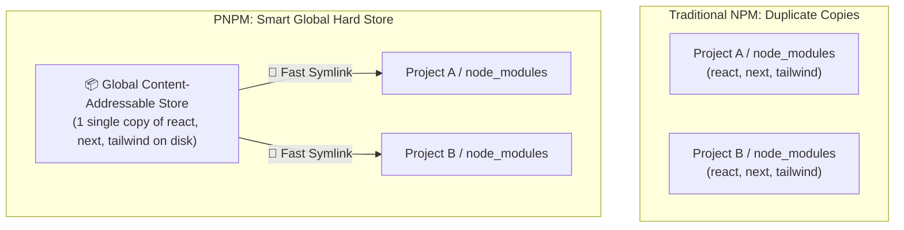
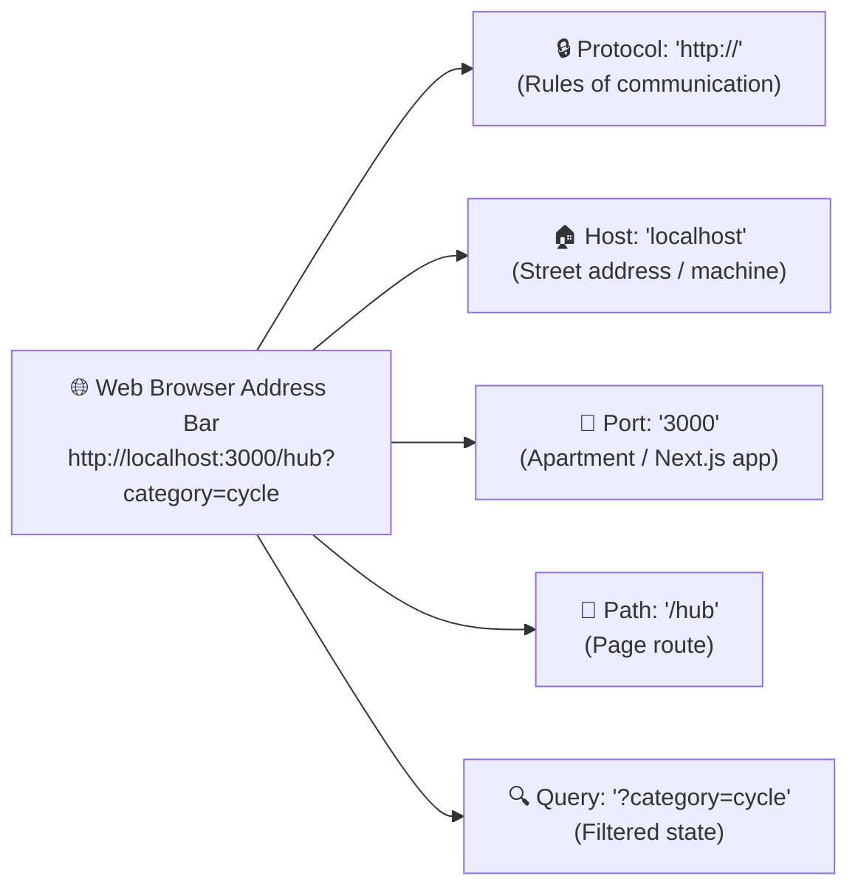
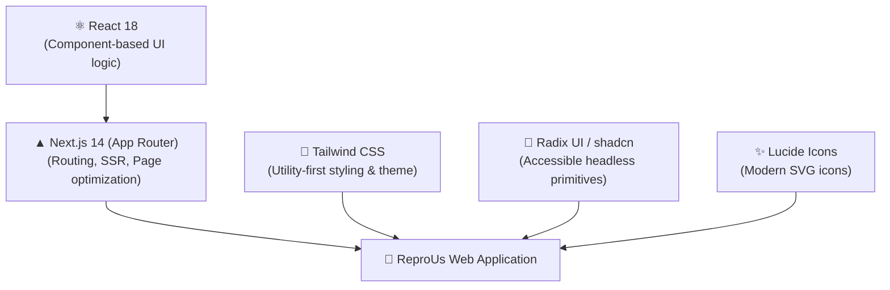
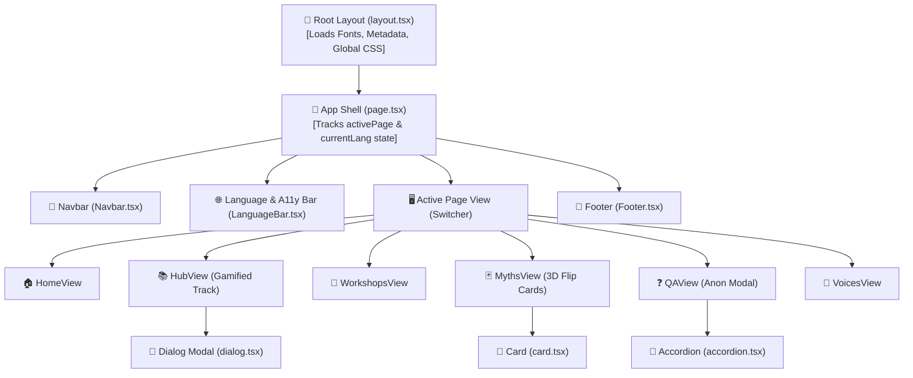
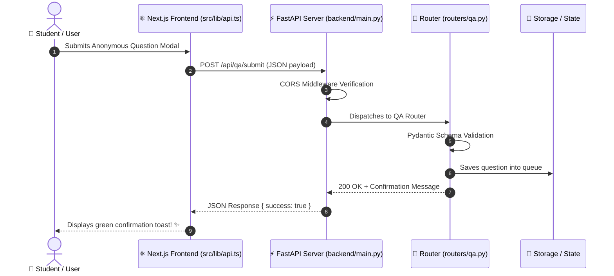
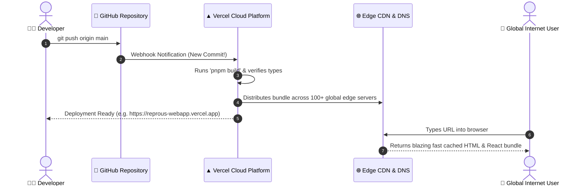

# 🚀 ReproUs: The Ultimate Developer's Guide
*A beginner-friendly handbook to modern web development, full-stack architecture, and deployment.*

Welcome to the **ReproUs** engineering team! Whether you are writing your first lines of code, exploring "vibe coding" with AI assistants, or building full-stack applications, this guide will walk you through everything you need to know.

---

## 🗺️ Table of Contents
1. [🌟 Welcome & Big Picture](#-welcome--big-picture)
2. [📁 Project Anatomy & File Structure](#-project-anatomy--file-structure)
3. [🔄 The Developer SDLC (Software Development Life Cycle)](#-the-developer-sdlc-software-development-life-cycle)
4. [📦 Package Management with PNPM](#-package-management-with-pnpm)
5. [💻 Development Environment: Host, Port, and URLs](#-development-environment-host-port-and-urls)
6. [🎨 The Frontend Stack: Next.js, Tailwind & UI Primitives](#-the-frontend-stack-nextjs-tailwind--ui-primitives)
7. [⚡ The Backend: Python & FastAPI](#-the-backend-python--fastapi)
8. [☁️ Production & Deploying to the World with Vercel](#️-production--deploying-to-the-world-with-vercel)
9. [📚 Developer Toolkit & Official Learning Resources](#-developer-toolkit--official-learning-resources)

---

## 🌟 Welcome & Big Picture

### What is ReproUs?
**ReproUs** is an interactive, judgment-free reproductive health learning platform designed specifically for youth and young adults. It features:
- A Duolingo-style gamified learning trail with streak counters and XP points.
- 3D flip cards for debunking myths and facts.
- Interactive workshop RSVP and community story submissions.
- Multi-language support and accessibility tools (text resizers, high contrast).

### How a Modern Web App Works
Think of building a website like building a smart restaurant:



- **Frontend (`src/`)**: What the user sees and interacts with (buttons, animations, text, layout). Built with **Next.js**, **React**, and **Tailwind CSS**.
- **Backend (`backend/`)**: The engine behind the scenes that processes data (like submitting questions anonymously, booking workshops, or calculating scores). Built with **Python** and **FastAPI**.

---

## 📁 Project Anatomy & File Structure

Here is a map of the repository so you know exactly where everything lives:

```
reprous-webapp/
├── 📄 package.json          # List of project dependencies & run scripts
├── 📄 pnpm-lock.yaml        # Exact snapshot of installed package versions
├── 📄 tsconfig.json         # TypeScript configuration (type checker rules)
├── 📄 tailwind.config.ts    # Custom color palette, fonts, and shadow tokens
├── 📄 next.config.mjs       # Next.js framework settings
├── 📄 vercel.json           # Cloud deployment routing rules
├── 📄 .env.local            # Local secret variables (API keys, ports)
│
├── 📂 src/                  # FRONTEND APPLICATION CODE
│   ├── 📂 app/              # Next.js App Router (pages & layouts)
│   │   ├── layout.tsx       # Root wrapper (loads fonts, headers, metadata)
│   │   ├── page.tsx         # Main interactive single-page app switcher
│   │   └── globals.css      # CSS variables, 3D flip card styles, a11y modes
│   │
│   ├── 📂 components/       # Reusable Lego-brick UI components
│   │   ├── 📂 layout/       # Navbar, LanguageBar, Footer
│   │   ├── 📂 pages/        # Views: Home, Story, Hub, Workshops, Resources, QA, Myths, Voices
│   │   ├── 📂 shared/       # Icons & logos (ReproUsMark, AccessMini)
│   │   └── 📂 ui/           # Radix/shadcn UI blocks (Button, Dialog, Accordion, Card, Badge)
│   │
│   ├── 📂 data/             # Content data (topics, quizzes, myths, FAQs, clinics)
│   │   ├── hubData.ts       # 7 learning categories & trail nodes
│   │   ├── mythsData.ts     # Flip card content
│   │   ├── workshopsData.ts # Workshop agendas & schedule
│   │   ├── faqsData.ts      # Q&A directory
│   │   └── clinicsData.ts   # Free & sliding-scale clinics
│   │
│   └── 📂 lib/              # Helper utilities & API callers
│       ├── utils.ts         # 'cn()' CSS class merging helper
│       └── api.ts           # Frontend-to-backend network functions
│
├── 📂 backend/              # BACKEND API SERVICE (Python)
│   ├── main.py              # FastAPI server entry point & CORS configuration
│   ├── requirements.txt     # Python packages list (fastapi, uvicorn, pydantic)
│   └── 📂 routers/          # Modular API endpoints (hub, workshops, qa, voices, clinics)
│
├── 📂 docs/                 # Project documentation and developer guides
├── 📂 infra/                # CI/CD and deployment configurations
└── 📂 scripts/              # Automation scripts (e.g., git & vercel setup helpers)
```

### Key Config Files You Should Know:
| File | What it Does | Clickable Link |
|---|---|---|
| `package.json` | The "ingredient list" for JavaScript. Tells PNPM which libraries to install and what commands can be run. | [package.json](file:///Users/corinnelucas/dev/projects/ReproUs/reprous-webapp/package.json) |
| `tailwind.config.ts` | Defines custom theme colors like `--blush` (`#FBEAE6`), `--yellow` (`#F8D989`), and `--berry` (`#7A3B4E`). | [tailwind.config.ts](file:///Users/corinnelucas/dev/projects/ReproUs/reprous-webapp/tailwind.config.ts) |
| `globals.css` | Base stylesheet containing font imports, high-contrast mode, and 3D card flip keyframes. | [globals.css](file:///Users/corinnelucas/dev/projects/ReproUs/reprous-webapp/src/app/globals.css) |
| `page.tsx` | Main frontend component switching between different navigation tabs (`home`, `hub`, `workshops`, etc.). | [page.tsx](file:///Users/corinnelucas/dev/projects/ReproUs/reprous-webapp/src/app/page.tsx) |
| `main.py` | Python FastAPI backend entrypoint that listens for API requests. | [main.py](file:///Users/corinnelucas/dev/projects/ReproUs/reprous-webapp/backend/main.py) |

---

## 🔄 The Developer SDLC (Software Development Life Cycle)

As a software engineer, you don't just randomly change files on a live website. You follow an organized cycle called the **SDLC** (Software Development Life Cycle).



### The 6 Stages of Development:

1. **Plan & Understand**: Understand what you want to build. (e.g., *"I want to add a quiz question about iron deficiency in athletes"*).
2. **Code (Local Development)**: Edit files in `src/` using your code editor. Use AI assistants ("vibe coding") to generate or refine ideas, but always verify how the code works!
3. **Preview & Test**: Watch your changes instantly update in your local browser on `http://localhost:3000`. Test on mobile and desktop screen sizes.
4. **Save with Git (Version Control)**:
   ```bash
   git add .
   git commit -m "feat: add athlete nutrition quiz card to hub"
   ```
   > 💡 *Want to master Git branching, commits, and pull requests? Check out the dedicated [Beginner's Guide to Git & GitHub](file:///Users/corinnelucas/dev/projects/ReproUs/reprous-webapp/docs/GIT_GUIDE.md).*
5. **Verify**: Run `pnpm build` to ensure there are zero TypeScript errors.
6. **Deploy**: Push to GitHub, where Vercel automatically builds and deploys your changes to the live internet.

---

## 📦 Package Management with PNPM

### What is a Package Manager?
In modern programming, you don't write every single feature (like date formatters, dialog modals, or icon renderers) from scratch. You use open-source **packages** (also called libraries or dependencies).

A **Package Manager** is like an App Store for code libraries. It downloads, updates, and manages those packages for your project.

### Why PNPM instead of standard NPM?
- **NPM (Node Package Manager)**: Downloads duplicate copies of libraries into every project folder, eating up gigabytes of your hard drive.
- **PNPM (Performant NPM)**: Uses a clever **content-addressable store**. It saves one copy of a library on your computer and creates fast, lightweight links (symlinks) to it. It is **2x–3x faster** and saves huge amounts of disk space!



### Essential PNPM Commands:

```bash
# 1. Install all dependencies listed in package.json
pnpm install

# 2. Start the local development server (instant hot-reloading)
pnpm dev

# 3. Test building the production bundle (checks for TypeScript errors)
pnpm build

# 4. Run the production build locally
pnpm start

# 5. Check your code for formatting and syntax issues
pnpm lint
```

> [!TIP]
> **What is `node_modules/`?**
> When you run `pnpm install`, a folder called `node_modules/` is generated. It contains all the installed code libraries. You should **never** edit files inside `node_modules` manually or commit them to Git (it is listed in `.gitignore`).

---

## 💻 Development Environment: Host, Port, and URLs

When you run `pnpm dev`, Next.js prints:
```text
  ▲ Next.js 14.2.35
  - Local:        http://localhost:3000
```
What does this actually mean? Let's break down the networking concepts.

### 1. What is a "Development Environment"?
Your computer is your **local sandbox** (Development Environment). Anything you test here is private to your laptop. If your code breaks or has a bug, no real user on the internet is affected.

### 2. The Anatomy of a Web URL
When you type `http://localhost:3000/hub?category=cycle` into Chrome, here is how the computer decodes it:

```
        http://localhost:3000/hub?category=cycle
        └──┬─┘ └───┬───┘ └──┬─┘ └──┬┘ └────┬────┘
           │       │        │      │       └── Query Parameter (extra data)
           │       │        │      └────────── Path (which page to display)
           │       │        └───────────────── Port (which application receives the message)
           │       └────────────────────────── Host (which machine/computer to talk to)
           └────────────────────────────────── Protocol (rules for communication)
```



### 3. Host vs. Port (The Apartment Building Analogy)
Imagine you want to send a letter to a friend:
- **Host / IP Address (`localhost` / `127.0.0.1`)**: This is the **Street Address** of the building. `localhost` is a special alias that means *"this computer right here"*.
- **Port (`:3000`, `:8000`)**: This is the **Apartment Number** inside the building!
  - **Port `3000`**: Apartment of your **Next.js Frontend**.
  - **Port `8000`**: Apartment of your **FastAPI Python Backend**.
  - Without the port, your computer wouldn't know whether incoming network traffic is meant for Next.js, Python, or Spotify!

```mermaid
graph TD
    subgraph Your Computer (localhost / 127.0.0.1)
        Port3000["🚪 Port 3000: Next.js Frontend Server\n(Renders HTML, CSS, React UI)"]
        Port8000["🚪 Port 8000: FastAPI Backend Server\n(Handles Q&A submissions & RSVP data)"]
    end
    Browser["🌐 Web Browser\n(Navigates to http://localhost:3000)"] --> Port3000
    Port3000 -.->|Internal API calls| Port8000
```

### 4. Fast Refresh / Hot Reloading
When running in development (`pnpm dev`), Next.js watches your code files. The moment you press `Cmd + S` (Save) in a component like `HomeView.tsx`, the browser updates the UI in **under 100 milliseconds** without you having to manually refresh the page!

---

## 🎨 The Frontend Stack: Next.js, Tailwind & UI Primitives

The ReproUs frontend is built on the most popular, industry-standard modern web stack:



### Component Hierarchy & Architecture:
Here is how React components nest together to build the interactive app:



### 1. Next.js 14 (App Router)
- **What is React?** A library where you build reusable UI blocks called **Components** (like `<Button />`, `<Navbar />`, `<FlipCard />`).
- **What is Next.js?** A full-stack framework built on top of React. It provides built-in page routing, super-fast image optimization, and server-side rendering.
- **Client Components (`"use client"`)**: When a component uses buttons, state (`useState`), or user clicks, we put `"use client"` at the very top of the file so Next.js knows to run its interactivity in the user's browser.

### 2. Tailwind CSS (Utility-First Styling)
Instead of writing 50 lines of separate `.css` files, Tailwind allows you to style elements directly inside your JSX tags using simple, readable utility classes:

```tsx
// Example of a ReproUs styled card with Tailwind:
<div className="bg-cream-card rounded-3xl p-6 shadow-card hover:shadow-hover hover:-translate-y-1 transition-all duration-300">
  <h3 className="font-serif text-berry text-2xl font-bold">Body Basics</h3>
  <p className="text-ink/80 mt-2">Discover how your body grows and changes.</p>
</div>
```
- `bg-cream-card`: Sets background to our custom cream color (`#FFF8F3`).
- `rounded-3xl`: Gives smooth 24px curved corners.
- `shadow-card`: Applies our soft custom shadow.
- `hover:-translate-y-1`: Lifts the card up by 4 pixels when hovered.

### 3. Radix UI & shadcn/ui (Accessible Component Primitives)
Building complex interactive components like popups (dialogs), dropdown menus, and accordion FAQ lists from scratch is hard because of accessibility (making sure blind users with screen readers or people using only keyboards can navigate).

We use **Radix UI** primitives located in [src/components/ui/](file:///Users/corinnelucas/dev/projects/ReproUs/reprous-webapp/src/components/ui):
- [`dialog.tsx`](file:///Users/corinnelucas/dev/projects/ReproUs/reprous-webapp/src/components/ui/dialog.tsx): For the anonymous question submission popup and lesson modals.
- [`accordion.tsx`](file:///Users/corinnelucas/dev/projects/ReproUs/reprous-webapp/src/components/ui/accordion.tsx): For expanding and collapsing FAQ answers.
- [`button.tsx`](file:///Users/corinnelucas/dev/projects/ReproUs/reprous-webapp/src/components/ui/button.tsx): For consistent, branded buttons.

---

## ⚡ The Backend: Python & FastAPI

While the frontend handles what the user sees, the backend handles data processing and storage.



### Running the Python Backend Locally:
```bash
# 1. Navigate to backend directory
cd backend

# 2. Create a virtual environment (isolates Python packages)
python3 -m venv venv

# 3. Activate the virtual environment
source venv/bin/activate    # On Mac/Linux
# .\venv\Scripts\activate   # On Windows

# 4. Install Python dependencies
pip install -r requirements.txt

# 5. Start the backend server on port 8000
uvicorn main:app --reload --port 8000
```

### Interactive API Documentation (Swagger UI):
Once the backend is running, open [http://127.0.0.1:8000/docs](http://127.0.0.1:8000/docs) in your browser. FastAPI automatically creates an interactive playground where you can test submitting questions and reading workshop lists!

---

## ☁️ Production & Deploying to the World with Vercel

When your code is ready and tested on your laptop, you want your friends, classmates, and users worldwide to access it. This means moving from the **Development Environment** to the **Production Environment**.



### 1. Development vs. Production:
| Feature | Development (`localhost`) | Production (`vercel.app`) |
|---|---|---|
| **Where it runs** | On your personal computer | High-speed cloud servers across the world |
| **Who can see it** | Only you | Anyone with the URL on the internet |
| **URL Format** | `http://localhost:3000` | `https://reprous-webapp.vercel.app` |
| **Speed/Optimization** | Unminified code for fast editing | Minified, compressed, zero-dead-code bundle |
| **Security** | Plain HTTP (no lock icon) | HTTPS (encrypted with SSL certificate) |

### 2. How the Production URL is Generated
1. **Domain Name**: When you deploy on Vercel, you get a free domain:
   `https://<your-project-name>.vercel.app` (e.g., `https://reprous-webapp.vercel.app`). You can also attach a custom domain like `https://reprous.org`.
2. **DNS (Domain Name System)**: DNS is the internet's contact book. When someone types `reprous-webapp.vercel.app`, DNS converts that name into the closest server's IP address.
3. **SSL/TLS Encryption (`https://`)**: Vercel automatically issues an SSL certificate (the padlock icon in the URL bar), ensuring that user data (like anonymous questions) is encrypted and safe from eavesdroppers.
4. **Edge CDN (Content Delivery Network)**: Your website is mirrored in data centers around the globe (Tokyo, London, New York, São Paulo), so users experience near-instant load times no matter where they live.

### 3. Step-by-Step Vercel Deployment Guide:
1. **Push your code to GitHub**:
   ```bash
   git add .
   git commit -m "feat: complete developer guide"
   git push origin main
   ```
2. **Import Project to Vercel**:
   - Go to [vercel.com](https://vercel.com) and log in with your GitHub account.
   - Click **Add New...** → **Project**.
   - Select your repository (`reprous-webapp`).
   - Leave the Framework Preset as **Next.js**.
   - Click **Deploy**!
3. **Continuous Deployment (CI/CD)**:
   - Any time you push a new commit to the `main` branch on GitHub, Vercel automatically builds and updates the live website within 60 seconds!

---

## 📚 Developer Toolkit & Official Learning Resources

Bookmark these official resources to explore deeper and level up your engineering skills:

### 🌟 Core Technologies
- **[Next.js Documentation](https://nextjs.org/docs)**: The official guide for Next.js App Router, routing, components, and data fetching.
- **[React Documentation](https://react.dev/)**: Interactive tutorials on components, `useState`, `useEffect`, and props.
- **[Tailwind CSS Docs](https://tailwindcss.com/docs)**: Searchable cheatsheet for every CSS utility class and styling trick.
- **[TypeScript Handbook](https://www.typescriptlang.org/docs/)**: Guide to type safety, interfaces, and avoiding common bugs.
- **[FastAPI Tutorial](https://fastapi.tiangolo.com/tutorial/)**: Beginner guide to building Python REST APIs with automatic documentation.

### 🧱 UI Libraries & Icons
- **[Radix UI Primitives](https://www.radix-ui.com/primitives/docs/overview/introduction)**: Unstyled, fully accessible UI components.
- **[shadcn/ui Components](https://ui.shadcn.com/)**: Beautifully designed, accessible components you can copy and customize.
- **[Lucide Icons](https://lucide.dev/icons/)**: Directory of thousands of sleek SVG icons used throughout the app.

### 🌐 Web Standards & Cloud
- **[MDN Web Docs (Mozilla)](https://developer.mozilla.org/en-US/)**: The gold-standard encyclopedia for HTML, CSS, JavaScript, and Web APIs.
- **[Vercel Documentation](https://vercel.com/docs)**: Learn how edge deployments, previews, and serverless hosting work.

---

### 🎉 Happy Coding!
Remember: every senior software engineer started right where you are now. Experiment with code, inspect elements in DevTools, test your ideas, and enjoy building things that make a difference! 🚀
