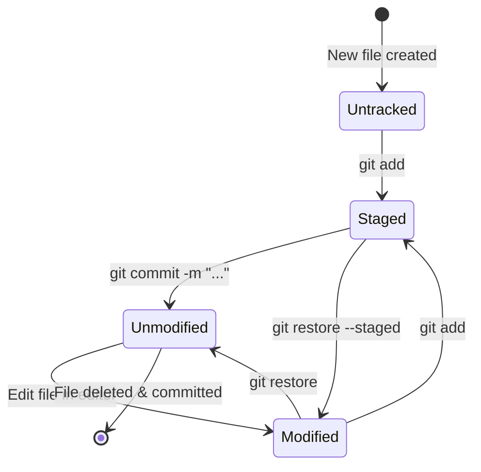
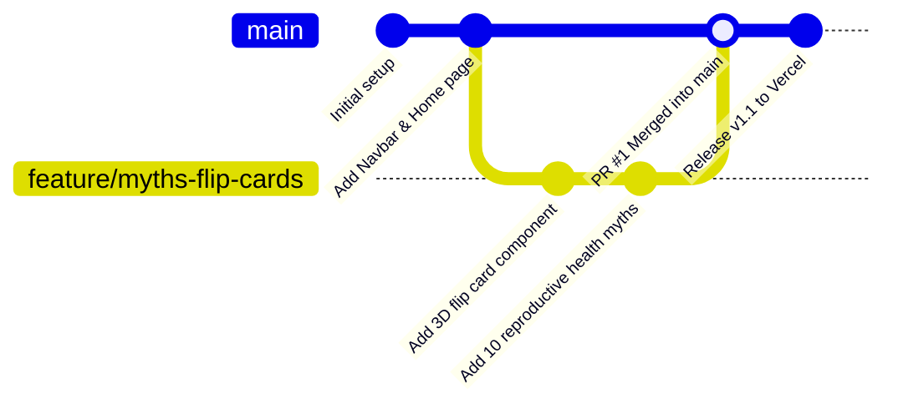
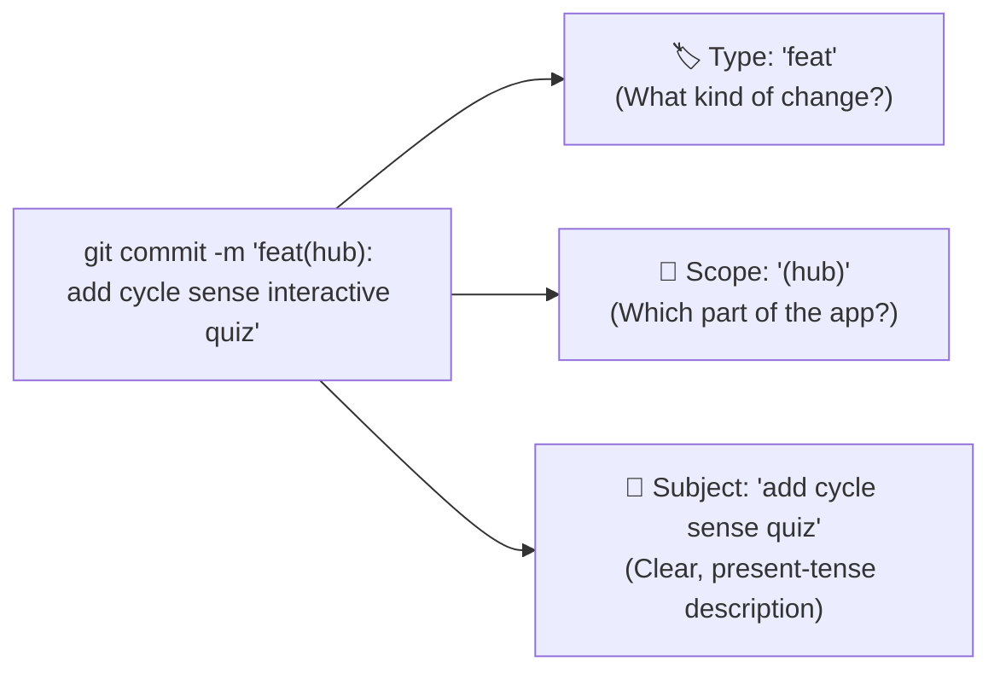
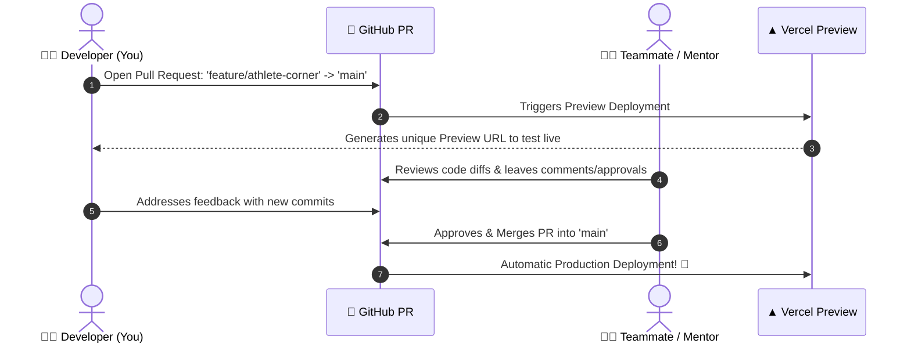

# 🐙 Beginner's Guide to Git & GitHub
*Mastering Version Control, Git Flow, and Team Collaboration for ReproUs.*

Welcome to the **Git & GitHub Guide**! If you've ever played a video game where you can save your progress before a boss fight, or used Google Docs revision history to see who edited what, you already understand the core idea behind **Git**.

---

## 🗺️ Table of Contents
1. [🎮 Why Version Control Matters: The Video Game Save Point](#-why-version-control-matters-the-video-game-save-point)
2. [🗺️ The 4 Zones of Git: How Git Works Under the Hood](#️-the-4-zones-of-git-how-git-works-under-the-hood)
3. [🔄 Git File Lifecycle: The 4 States of a File](#-git-file-lifecycle-the-4-states-of-a-file)
4. [🌿 Git Flow & Branching: Building Features Safely](#-git-flow--branching-building-features-safely)
5. [🛠️ Daily Commands: Add, Commit, Push & Status](#️-daily-commands-add-commit-push--status)
6. [✍️ Writing Great Commit Comments (Conventional Commits)](#️-writing-great-commit-comments-conventional-commits)
7. [🤝 Pull Requests & Code Reviews on GitHub](#-pull-requests--code-reviews-on-github)
8. [🛡️ The Secret Keeper: What is `.gitignore`?](#️-the-secret-keeper-what-is-gitignore)
9. [🛟 Safe Undos & Stashing](#-safe-undos--stashing)
10. [⚡ Git Cheat Sheet & Learning Resources](#-git-cheat-sheet--learning-resources)

---

## 🎮 Why Version Control Matters: The Video Game Save Point

### The "Old Way" (Chaos):
Before Git, people used to manage files by renaming folders:
- `reprous-project/`
- `reprous-project-v2/`
- `reprous-project-final/`
- `reprous-project-final-ACTUALLY-FINAL-v3.zip`

This led to lost work, confusion about who changed what, and no way to easily undo a bug without breaking everything.

### The "Git Way" (Superpower):
**Git** is a **Version Control System (VCS)** that tracks the exact history of every single character in your code.
- 🕒 **Time Machine**: You can jump back to any previous version of your code from 2 hours ago or 2 months ago.
- 💾 **Save Points (Commits)**: You create checkpoint snapshots whenever you finish a feature or fix a bug.
- 👥 **Teamwork without Overwriting**: Multiple people can work on different pages at the exact same time without overwriting each other's code.

---

## 🗺️ The 4 Zones of Git: How Git Works Under the Hood

When you edit code on your computer, your changes travel through **4 distinct zones**:

```mermaid
graph LR
    subgraph Your Computer (Local)
        WD["1. 📝 Working Directory\n(Your active code editor)"]
        SA["2. 📦 Staging Area (Index)\n(The packing box for your save point)"]
        LR["3. 💾 Local Repository\n(Your personal history on disk)"]
    end
    subgraph The Cloud (Remote)
        GH["4. ☁️ Remote Repo (GitHub)\n(The shared cloud team repo)"]
    end

    WD -->|git add| SA
    SA -->|git commit| LR
    LR -->|git push| GH
    GH -->|git pull| WD
```

### The Shopping Analogy:
1. **Working Directory**: Items on the store shelves you are looking at and editing.
2. **Staging Area (`git add`)**: Putting the specific items you want to buy into your **shopping cart**.
3. **Local Repository (`git commit`)**: Paying at the cash register and getting a **timestamped receipt**.
4. **Remote Repository (`git push`)**: Sharing your haul with your friends on the cloud (GitHub).

---

## 🔄 Git File Lifecycle: The 4 States of a File

Every file in your project moves between states as you work on it:



- **Untracked**: Git sees the file for the first time, but isn't tracking changes yet.
- **Modified**: You changed an existing tracked file in your editor, but haven't staged it yet (shows red in `git status`).
- **Staged**: You added the file to the next commit payload with `git add` (shows green in `git status`).
- **Unmodified / Committed**: The file is safely locked into the project history.

---

## 🌿 Git Flow & Branching: Building Features Safely

### What is a Branch?
Think of a tree trunk. The main trunk is called `main` (or `master`). It contains the live, working code that users see on the internet.

When you want to build a new feature or experiment with a design, you **never** code directly on `main`. Instead, you sprout a new **branch** off the trunk!



### Why Branches are Essential:
- You can experiment freely. If your idea doesn't work, you can delete the branch without touching `main`.
- Your unfinished code won't accidentally break the production website on Vercel.

---

## 🛠️ Daily Commands: Add, Commit, Push & Status

Here is your daily step-by-step workflow:

### Step 1: Check your current state
Before doing anything, ask Git what files have changed:
```bash
git status
```
- **Red files**: Files you modified that are not staged yet.
- **Green files**: Files that are staged and ready to be committed.

### Step 2: Create and switch to a new branch
Name your branch after the feature you are building:
```bash
# Creates and switches to a new branch called 'feature/athlete-corner'
git checkout -b feature/athlete-corner
```

### Step 3: Stage your changes (Packing the box)
When you have created or edited files:
```bash
# Stage a specific file
git add src/data/hubData.ts

# OR stage all modified and new files at once
git add .
```

### Step 4: Commit your changes (The Save Point)
A commit permanently records your staged changes with a descriptive message:
```bash
git commit -m "feat: add athlete nutrition quiz card to learning hub"
```

### Step 5: Push your branch to GitHub (Cloud Backup)
Upload your branch to GitHub so others can see it and Vercel can build a preview:
```bash
git push -u origin feature/athlete-corner
```
*(The `-u` stands for upstream, which links your local branch to the GitHub branch for future `git push` shortcuts).*

### Step 6: Pull the latest changes from your teammates
Before starting work each morning, grab the latest updates from `main`:
```bash
git checkout main
git pull origin main
```

---

## ✍️ Writing Great Commit Comments (Conventional Commits)

Your commit message tells the story of your project. Writing clear comments helps you and your teammates understand *why* a change was made when looking back months later.

### Anatomy of a Commit Message:



### The Conventional Commits Standard:

| Type | When to Use | Example |
|---|---|---|
| `feat:` | A brand new feature for the user | `git commit -m "feat: add 5-language switcher to navbar"` |
| `fix:` | A bug fix | `git commit -m "fix: resolve text overflow on mobile quiz cards"` |
| `docs:` | Changes to documentation or guides | `git commit -m "docs: add beginner git guide"` |
| `style:` | Formatting, CSS padding, spacing, colors | `git commit -m "style: tweak blush background color variable"` |
| `refactor:`| Code cleanup with no behavior change | `git commit -m "refactor: simplify clinic search filtering logic"` |
| `test:` | Adding or fixing automated tests | `git commit -m "test: add unit test for anonymous question submission"` |
| `chore:` | Updating dependencies or config files | `git commit -m "chore: update pnpm lockfile dependencies"` |

> [!TIP]
> **Pro Tip**: Use active, present-tense verbs! Write `"feat: add button"` instead of `"added button"` or `"adding button"`.

---

## 🤝 Pull Requests & Code Reviews on GitHub

Once you've pushed your feature branch to GitHub, how does it get into the live `main` branch? Through a **Pull Request (PR)**!



### How to Open and Review a Pull Request:
1. **Open the PR**:
   - Go to your repository on [github.com](https://github.com).
   - You will see a yellow banner: **"feature/athlete-corner had recent pushes. Compare & pull request"**.
   - Click **Compare & pull request**.
2. **Describe Your Changes**:
   - Give it a clear title (e.g., `feat: Add Athlete Corner module to Learning Hub`).
   - List what you built, add screenshots if you changed UI, and mention how you tested it.
3. **Inspect the Diff**:
   - Click the **Files changed** tab. Green lines are additions (`+`), red lines are deletions (`-`).
4. **Merge**:
   - Once approved and tests pass, click **Merge pull request**!

---

## 🛡️ The Secret Keeper: What is `.gitignore`?

Not every file on your laptop belongs on GitHub! Some files should **never** be committed:
- 🔒 **Secrets & Passwords**: `.env.local` (contains database passwords, API keys).
- 📦 **Giant Downloaded Folders**: `node_modules/` (can be thousands of files; anyone can regenerate it with `pnpm install`).
- 🏗️ **Temporary Build Artifacts**: `.next/`, `dist/`, `*.pyc` (temporary files generated during build).
- 💻 **OS Junk**: `.DS_Store` (Mac folder preferences).

The [`.gitignore`](file:///Users/corinnelucas/dev/projects/ReproUs/reprous-webapp/.gitignore) file tells Git to completely ignore these files.

```gitignore
# Example .gitignore snippet:
node_modules
.next
.env.local
.DS_Store
```

> [!CAUTION]
> **Never commit API keys or passwords!**
> If you accidentally commit an API key to a public GitHub repository, automated bots on the internet will find it in seconds. Always keep your secrets in `.env.local`.

---

## 🛟 Safe Undos & Stashing

Don't panic! Git is designed so you almost never lose code if you know these safe commands:

### Visualizing Git Stash:
```mermaid
graph LR
    subgraph Active Working Tree
        Unfinished["✏️ Unfinished Changes\n(in HomeView.tsx)"]
    end

    subgraph Stash Clipboard (Storage)
        Stack["📦 Stash Stack\n[stash@{0}: WIP on HomeView]"]
    end

    Unfinished -->|1. 'git stash'| Stack
    Stack -->|2. 'git stash pop'| Unfinished
```

### 1. "I made changes to a file, but I messed up and want to start over."
```bash
# Discards your uncommitted changes in a specific file and restores it
git restore src/components/pages/HomeView.tsx
```

### 2. "I accidentally added a file with `git add`, but don't want to commit it yet."
```bash
# Unstages the file without deleting your code
git restore --staged src/components/pages/HomeView.tsx
```

### 3. "I want to temporarily stash away my changes to switch branches quickly."
```bash
# Saves your unfinished work into a temporary clipboard
git stash

# Later, restore your saved work:
git stash pop
```

### 4. "I want to see the exact changes I made before committing."
```bash
# Shows line-by-line colored diffs of what you changed
git diff
```

---

## ⚡ Git Cheat Sheet & Learning Resources

### 📋 Quick Command Cheatsheet:
| Action | Command |
|---|---|
| Check status | `git status` |
| View commit log | `git log --oneline -n 5` |
| Create new branch | `git checkout -b <branch-name>` |
| Switch branch | `git checkout <branch-name>` |
| Stage all changes | `git add .` |
| Commit changes | `git commit -m "<type>: <message>"` |
| Push to GitHub | `git push -u origin <branch-name>` |
| Pull latest main | `git pull origin main` |
| Show line changes | `git diff` |

### 🌐 Top Interactive Resources to Learn Git:
- **[GitHub Skills (Interactive Courses)](https://skills.github.com/)**: Free interactive sandbox tutorials directly on GitHub.
- **[Learn Git Branching (Visual Game)](https://learngitbranching.js.org/)**: The best visual drag-and-drop game to master branching, merging, and rebasing.
- **[Git - The Simple Guide](https://rogerdudler.github.io/git-guide/)**: A clean, zero-jargon one-page cheatsheet for beginners.
- **[Official Git Documentation](https://git-scm.com/doc)**: The definitive reference manual and Pro Git book.
- **[GitHub Flow Guide](https://docs.github.com/en/get-started/using-github/github-flow)**: The official GitHub workflow standard for teams.

---

### 💡 Golden Rules for Every Developer:
1. **Commit Early, Commit Often**: Small, focused commits are 100x easier to understand and fix than one massive commit with 50 changed files.
2. **Always pull before you push**: Keep your code synchronized with your team.
3. **Never push directly to `main`**: Always use a feature branch and a Pull Request.

Happy branching! 🌿🚀
