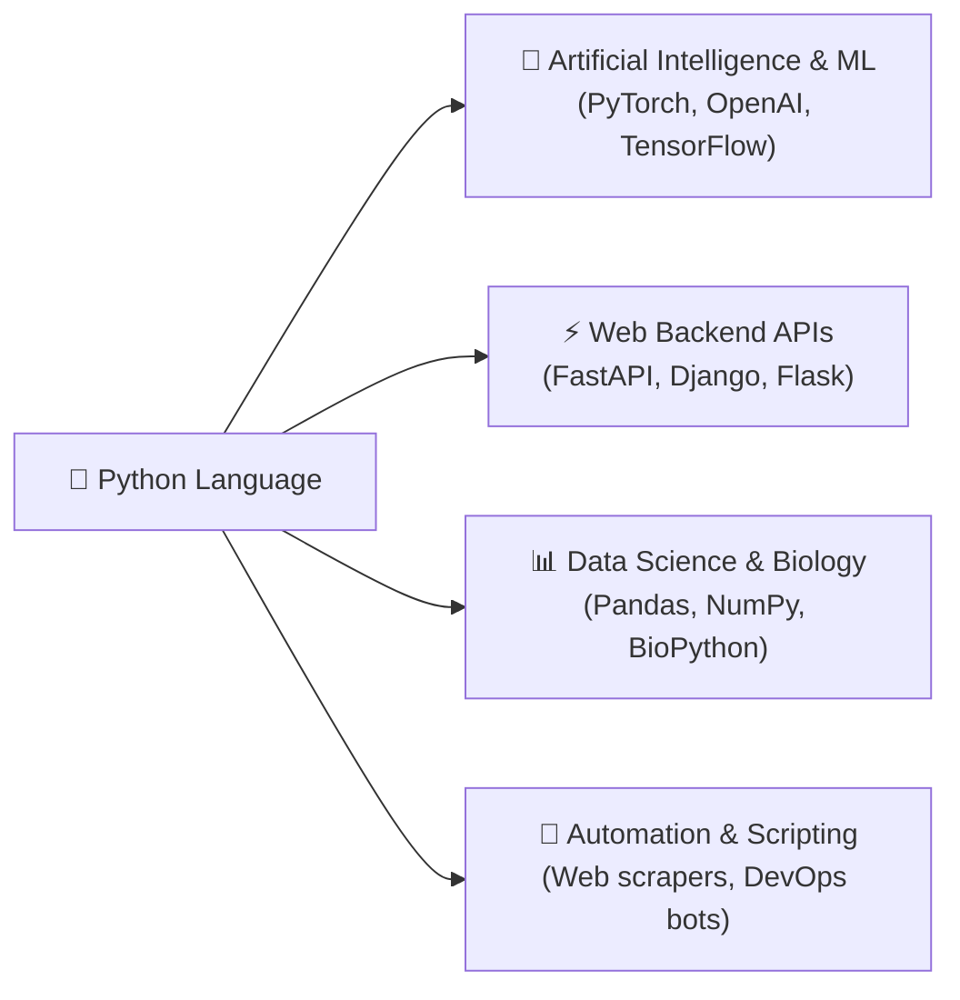
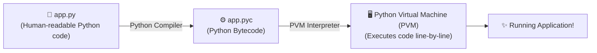
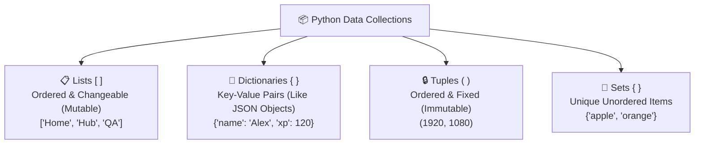
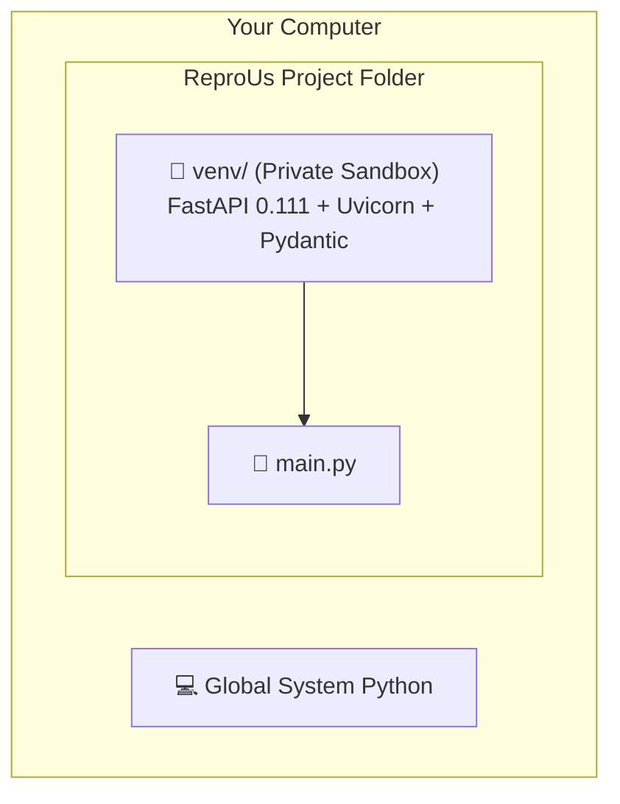
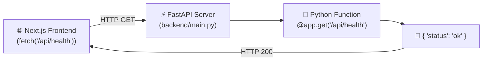

# 🐍 Introduction to Python: From First Script to Web APIs
*A beginner-friendly guide to modern Python, data structures, virtual environments, and FastAPI.*

Welcome to the **Introduction to Python**! Python is widely considered the friendliest and most powerful first programming language in the world. It powers everything from artificial intelligence (AI/ML) and scientific research to the backend API of **ReproUs**!

---

## 🗺️ Table of Contents
1. [🌟 Why Python? The Universal Superpower](#-why-python-the-universal-superpower)
2. [⚙️ How Python Works: Source to Bytecode](#️-how-python-works-source-to-bytecode)
3. [🧱 Core Foundations: Variables, Types & Logic](#-core-foundations-variables-types--logic)
4. [📦 Python Data Structures: Lists, Dictionaries & Tuples](#-python-data-structures-lists-dictionaries--tuples)
5. [🛠️ Functions & Type Hints: Writing Clean Code](#️-functions--type-hints-writing-clean-code)
6. [🫧 Python Virtual Environments (`venv`) & `pip`](#-python-virtual-environments-venv--pip)
7. [⚡ Building Web APIs with FastAPI in ReproUs](#-building-web-apis-with-fastapi-in-reprous)
8. [📚 Interactive Playgrounds & Learning Resources](#-interactive-playgrounds--learning-resources)

---

## 🌟 Why Python? The Universal Superpower

### 1. English-Like Readability:
Python was designed with human beings in mind. Compare printing a message in Java vs. Python:

```java
// Java:
public class Main {
    public static void main(String[] args) {
        System.out.println("Hello, ReproUs!");
    }
}
```

```python
# Python (Clean, elegant, 1 line!):
print("Hello, ReproUs!")
```

### 2. Used Across Every Tech Industry:


---

## ⚙️ How Python Works: Source to Bytecode

Unlike languages like C++ that compile directly to raw machine instructions, Python is an **interpreted language**:



- When you run `python3 main.py`, Python compiles your text into **bytecode** (stored in `__pycache__/`) and the **Python Virtual Machine** executes it immediately!

---

## 🧱 Core Foundations: Variables, Types & Logic

### 1. Variables and Data Types:
In Python, you don't need to declare variable types manually; Python infers them automatically:

```python
# Strings (text)
app_name = "ReproUs Learning Hub"

# Integers (whole numbers)
streak_days = 14

# Floats (decimals)
user_rating = 4.9

# Booleans (True / False)
is_anonymous = True
is_verified = False
```

### 2. Conditionals (`if / elif / else`):
Python uses **indentation (4 spaces)** instead of curly brackets `{}` to define code blocks:

```python
score = 85

if score >= 90:
    print("🏆 Gold Badge Unlocked!")
elif score >= 70:
    print("🥈 Silver Badge Unlocked!")
else:
    print("🌱 Keep practicing! You got this!")
```

### 3. Loops (`for` and `while`):
```python
# Repeating an action 3 times
for i in range(3):
    print(f"Lesson step {i + 1}")

# Iterating through a list of categories
categories = ["Body Basics", "Cycle Sense", "Real Talk"]
for category in categories:
    print(f"Exploring: {category}")
```

---

## 📦 Python Data Structures: Lists, Dictionaries & Tuples

Python gives you built-in data containers for storing collections of information:



### 1. Lists (Arrays):
```python
# A list of workshop topics
topics = ["Body Basics", "Cycle Sense", "Mind & Self"]

# Add a new topic
topics.append("Athlete Corner")

# Access by index (0-indexed)
print(topics[0])  # Output: "Body Basics"
```

### 2. Dictionaries (Key-Value pairs like JSON):
```python
# A student profile dictionary
student = {
    "alias": "CuriousCat24",
    "age": 16,
    "xp": 350,
    "unlocked_badges": ["Cycle Master", "Myth Buster"]
}

# Accessing values by key
print(student["alias"])  # Output: "CuriousCat24"

# Modifying values
student["xp"] += 50
print(student["xp"])     # Output: 400
```

---

## 🛠️ Functions & Type Hints: Writing Clean Code

Functions let you group code into reusable actions:

```python
# Type hints (str, int -> int) tell developers and editors what types to expect!
def add_points(current_xp: int, bonus: int = 50) -> int:
    """Calculates updated XP score after completing a lesson."""
    return current_xp + bonus

new_score = add_points(100, 25)
print(new_score)  # Output: 125
```

---

## 🫧 Python Virtual Environments (`venv`) & `pip`

### The Problem (Package Chaos):
If Project A needs `fastapi==0.100.0` and Project B needs `fastapi==0.80.0`, installing them globally on your laptop will cause conflicts and break things.

### The Solution: Virtual Environments (The Isolation Bubble):
A **Virtual Environment (`venv`)** creates a private, self-contained sandbox folder for your project's Python libraries:



### Daily Virtual Environment Workflow:
```bash
# 1. Create a fresh virtual environment inside your project
python3 -m venv venv

# 2. Activate the virtual environment
source venv/bin/activate    # Mac / Linux
# .\venv\Scripts\activate   # Windows

# (Your terminal prompt will now show: (venv) user@laptop $)

# 3. Install packages from requirements.txt (the Python package list)
pip install -r requirements.txt

# 4. Deactivate when you are finished
deactivate
```

---

## ⚡ Building Web APIs with FastAPI in ReproUs

In the ReproUs project, Python powers our backend API in [`reprous-webapp/backend/main.py`](file:///Users/corinnelucas/dev/projects/ReproUs/reprous-webapp/backend/main.py).

### How FastAPI Works:
FastAPI turns Python functions into web URLs (endpoints) that our React frontend can call:



### The ReproUs Backend Code:
```python
from fastapi import FastAPI
from pydantic import BaseModel

app = FastAPI(title="ReproUs Learning Hub API")

# 1. Define the data blueprint with Pydantic
class QuestionSubmission(BaseModel):
    category: str
    question: str
    age_range: str = "14-18"

# 2. Define the POST route
@app.post("/api/qa/submit")
def submit_question(data: QuestionSubmission):
    # Process the anonymous question safely
    return {
        "success": True,
        "message": f"Question in '{data.category}' received anonymously!"
    }
```

### Running and Testing the API:
```bash
cd backend
source venv/bin/activate
uvicorn main:app --reload --port 8000
```
Open **[http://127.0.0.1:8000/docs](http://127.0.0.1:8000/docs)** to test all endpoints using FastAPI's built-in interactive Swagger UI!

---

## 📚 Interactive Playgrounds & Learning Resources

Practice Python interactively with these beginner-friendly tools:

### 🌟 Practice in Your Browser
- **[FutureCoder (Interactive Course)](https://futurecoder.io/)**: Step-by-step beginner Python tutorials with built-in debugger visualizers.
- **[Official Python Beginner's Guide](https://www.python.org/about/gettingstarted/)**: The definitive starting point from Python.org.
- **[FastAPI Official Tutorial](https://fastapi.tiangolo.com/tutorial/)**: Learn how to build APIs with automatic documentation.
- **[W3Schools Python](https://www.w3schools.com/python/)**: Quick syntax cheatsheets and quizzes.

---

### 💡 Quick Summary for Future Engineers:
1. **Python** is readable, expressive, and used across AI, Web, and Data Science.
2. Indentation (4 spaces) defines code blocks; type hints make code clean and bug-free.
3. **Virtual Environments (`venv`)** keep project packages isolated and safe.
4. **FastAPI** transforms Python functions into blazing-fast REST APIs for your web applications! 🚀
