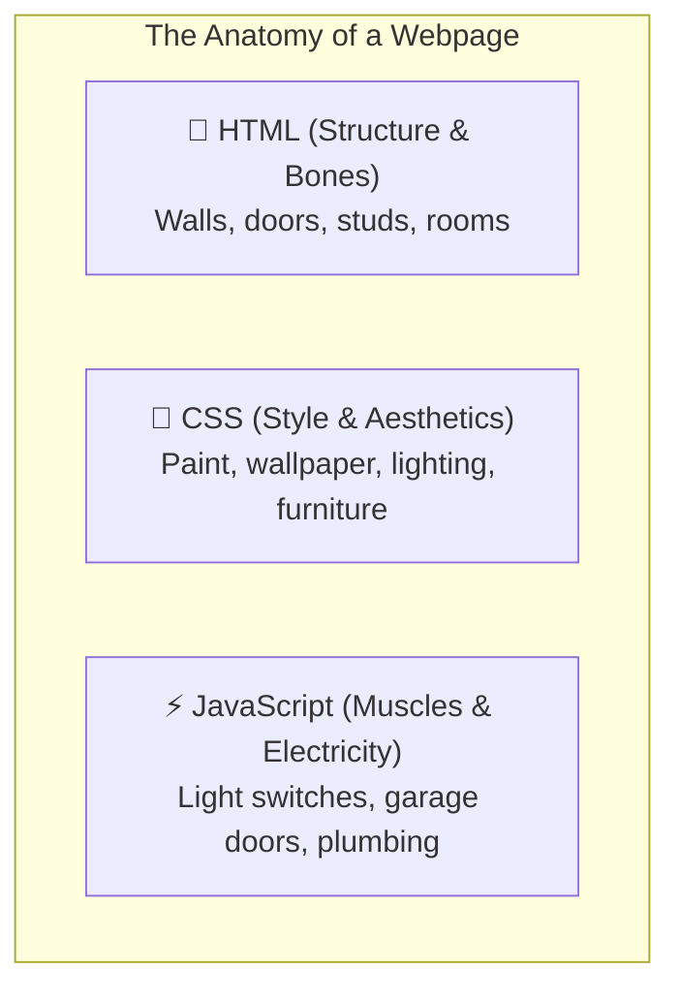
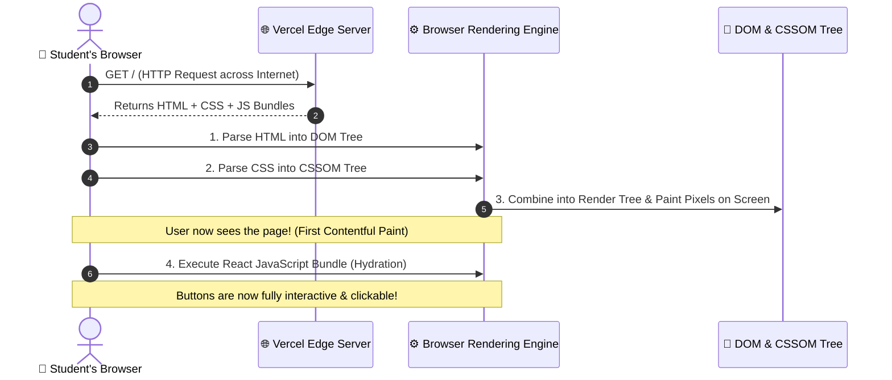
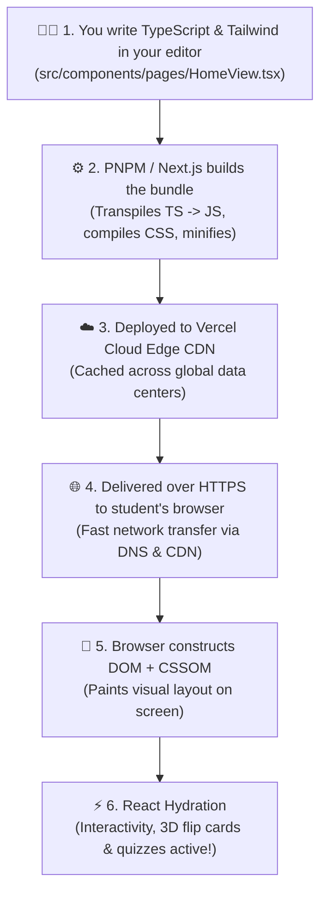

# 🌐 Web Development Foundations: HTML, CSS, TypeScript & The Browser Pipeline
*How code transforms from raw text in your editor into living, interactive apps on your screen.*

Welcome! If you've ever wondered what happens behind the scenes when you load a webpage, or how modern languages like **TypeScript** and **Tailwind CSS** get turned into something Chrome, Safari, or your phone can understand, this guide is for you!

---

## 🗺️ Table of Contents
1. [🏗️ The Core Trinity: HTML, CSS, and JavaScript](#️-the-core-trinity-html-css-and-javascript)
2. [🛡️ Why We Use TypeScript: The Developer's Guardian Angel](#️-why-we-use-typescript-the-developers-guardian-angel)
3. [📦 The Packaging Pipeline: Transpiling, Bundling & Minifying](#-the-packaging-pipeline-transpiling-bundling--minifying)
4. [🚀 Delivery to the Browser: Networking, DOM, and Hydration](#-delivery-to-the-browser-networking-dom-and-hydration)
5. [🔄 Putting It All Together: Complete Lifecycle Diagram](#-putting-it-all-together-complete-lifecycle-diagram)
6. [📚 Interactive Experiments & Sandbox Links](#-interactive-experiments--sandbox-links)

---

## 🏗️ The Core Trinity: HTML, CSS, and JavaScript

Every website on the internet—from Google and TikTok to **ReproUs**—is built on three foundational technologies.

### The House Analogy:


### 1. HTML (HyperText Markup Language) — The Skeleton
HTML provides the **content and semantic structure**. It uses nested **tags** enclosed in angle brackets:

```html
<!-- A simple reproductive health tip card -->
<div class="card">
  <h1>Body Basics</h1>
  <p>Your body changes in amazing ways during adolescence.</p>
  <button id="learn-btn">Explore Lessons</button>
</div>
```
- `<h1>`: The main heading.
- `<p>`: A paragraph of text.
- `<button>`: A clickable button element.

---

### 2. CSS (Cascading Style Sheets) — The Skin & Wardrobe
Without CSS, HTML looks like a plain black-and-white 1990s document. CSS adds **colors, spacing, fonts, animations, and responsive layouts**:

```css
/* Styling our tip card */
.card {
  background-color: #FFF8F3;    /* Cream background */
  border-radius: 24px;          /* Smooth rounded corners */
  padding: 24px;                /* Inner breathing room */
  box-shadow: 0 10px 25px rgba(0,0,0,0.05); /* Soft shadow */
}

h1 {
  color: #7A3B4E;               /* ReproUs Berry color */
  font-family: 'Fraunces', serif;
}

button {
  background-color: #F0C25E;    /* ReproUs Warm Yellow */
  color: #3A2C2E;
  padding: 12px 20px;
  border-radius: 9999px;        /* Pill shape */
  border: none;
  cursor: pointer;
  transition: transform 0.2s ease;
}

button:hover {
  transform: scale(1.05);       /* Subtle zoom on hover! */
}
```

---

### 3. JavaScript (JS) — The Brain & Nervous System
JavaScript makes the page **alive and interactive**. It responds to user actions, plays sounds, animates elements, and fetches data from the web:

```javascript
// Adding click interactivity to our button
const button = document.getElementById("learn-btn");

button.addEventListener("click", () => {
  alert("🎉 Welcome to the ReproUs Learning Hub!");
});
```

---

## 🛡️ Why We Use TypeScript: The Developer's Guardian Angel

### The Problem with Plain JavaScript:
JavaScript is dynamically typed and forgiving—sometimes *too* forgiving. If you make a typo or pass the wrong data, JavaScript won't tell you until your app crashes in front of a real user!

```javascript
// ❌ Dangerous JavaScript:
function calculateXP(user) {
  return user.points + 50; // What if 'user' has no points? Or 'user' is undefined? 💥 Crash!
}
```

### The TypeScript Solution:
**TypeScript (TS)** is JavaScript with a built-in **type safety system**. It acts like an AI spellchecker and guardian angel inside your code editor (VS Code), catching mistakes the second you type them!

```typescript
// ✅ Safe TypeScript:
interface UserProfile {
  name: string;
  points: number;
  streakDays: number;
  isYouthAmbassador: boolean;
}

function calculateXP(user: UserProfile): number {
  return user.points + 50; // TypeScript guarantees user.points is ALWAYS a valid number!
}
```

```mermaid
graph LR
    subgraph Development Time (Your Editor)
        TS["📝 TypeScript Code (.ts / .tsx)\n(Catches typos & bugs instantly)"]
        Compiler["⚙️ TypeScript Compiler (tsc / SWC)\n(Checks types & strips them away)"]
    end
    subgraph Browser Runtime
        JS["⚡ Clean JavaScript (.js)\n(Understood by all web browsers)"]
    end

    TS --> Compiler
    Compiler -->|Emits| JS
```

> [!IMPORTANT]
> **Crucial Fact**: Web browsers **do NOT understand TypeScript directly**. Browsers only understand plain JavaScript. That's why your TypeScript code is compiled (transpiled) into pure JavaScript before being sent to the browser!

---

## 📦 The Packaging Pipeline: Transpiling, Bundling & Minifying

When you build an app like **ReproUs**, you have hundreds of modular files: TypeScript components (`.tsx`), CSS stylesheets, icons, and libraries in `node_modules`.

How do hundreds of separate files turn into a fast, lightweight package? Through the **Build & Bundling Pipeline**!

```mermaid
graph TD
    subgraph 1. Source Files (Your Project)
        TSX["📄 HomeView.tsx\n(React + TS)"]
        Tailwind["🎨 globals.css\n(@tailwind classes)"]
        Icons["✨ lucide-react\n(SVG icon components)"]
        Data["📦 hubData.ts\n(Quiz JSON data)"]
    end

    subgraph 2. Next.js Compiler & Bundler
        Transpile["⚙️ Transpiler (SWC)\nConverts TypeScript & JSX -> Plain JS"]
        CSSProc["🎨 PostCSS & Tailwind Engine\nScans classes & generates minimal CSS"]
        TreeShake["🌲 Tree Shaking\nDeletes all unused code libraries"]
        Minify["🗜️ Minifier\nShrinks variable names & removes spaces"]
        Chunker["🧩 Code Splitter\nSplits into small chunk files"]
    end

    subgraph 3. Production Assets (Ready for Browser)
        HTMLOut["📄 index.html"]
        JSOut["⚡ chunks/app.min.js"]
        CSSOut["🎨 styles.min.css"]
    end

    TSX --> Transpile
    Data --> Transpile
    Icons --> Transpile
    Tailwind --> CSSProc

    Transpile --> TreeShake
    CSSProc --> Minify
    TreeShake --> Minify
    Minify --> Chunker

    Chunker --> HTMLOut
    Chunker --> JSOut
    Minify --> CSSOut
```

### The 4 Superpowers of the Bundler:
1. **Transpilation (JSX & TS ➔ JS)**: Converts modern React syntax (`<Button>Click</Button>`) into standard browser function calls (`React.createElement(...)`).
2. **Tailwind CSS Compilation**: Tailwind scans your code for classes you actually used (e.g., `bg-blush`, `rounded-3xl`) and discards the rest, turning a 3MB CSS framework into a tiny **10KB** stylesheet!
3. **Tree Shaking (Dead Code Elimination)**: If you import only 1 icon from a library of 1,000 icons, the bundler throws away the other 999 icons so your users don't have to download them.
4. **Minification**: Compresses your code by stripping comments, spaces, and renaming long variable names (`calculateTotalScore` ➔ `a`), making files up to **80% smaller**.

---

## 🚀 Delivery to the Browser: Networking, DOM, and Hydration

Once the files are bundled, what happens when a student enters `https://reprous-webapp.vercel.app` on their laptop or phone?



### The 3 Stages of Browser Rendering:

#### 1. The DOM (Document Object Model)
The browser reads the raw HTML text and turns it into a tree-like hierarchy of interactive objects:
```
           <html>
           /    \
      <head>    <body>
                  |
                <main>
                /    \
             <h1>    <button>
```

#### 2. The CSSOM & Render Tree
The browser matches your CSS styles to the DOM elements, calculates exact pixel coordinates, and **paints** the pixels onto your monitor.

#### 3. Hydration (Giving Life to React)
In Next.js, the server delivers the HTML so the user sees the page instantly. Then, the JavaScript bundle downloads in the background and **"hydrates"** the static HTML—attaching `onClick` listeners, quiz state, and animation loops so the page becomes completely interactive!

---

## 🔄 Putting It All Together: Complete Lifecycle Diagram

Here is the complete journey of code from your fingertips to a global user's screen:



---

## 📚 Interactive Experiments & Sandbox Links

Try out these live online sandboxes to experiment with HTML, CSS, and TypeScript right in your browser:

### 🌟 Interactive Playgrounds
- **[TypeScript Official Playground](https://www.typescriptlang.org/play)**: Write TypeScript and see the generated JavaScript side-by-side in real-time.
- **[Tailwind CSS Play](https://play.tailwindcss.com/)**: Experiment with utility classes and build UI components in a live browser sandbox.
- **[CodePen](https://codepen.io/)**: An online code editor to test HTML, CSS, and JS snippets instantly.
- **[MDN: Getting Started with the Web](https://developer.mozilla.org/en-US/docs/Learn/Getting_started_with_the_web)**: Step-by-step guides on HTML basics, CSS styling, and JavaScript logic.

---

### 💡 Quick Summary for Future Engineers:
1. **HTML** builds the bones.
2. **CSS** provides the beauty and layout.
3. **JavaScript** powers the brains and interactivity.
4. **TypeScript** protects you from bugs during development.
5. **Next.js & Bundlers** package everything into tiny, high-speed files for the world to enjoy! 🚀
